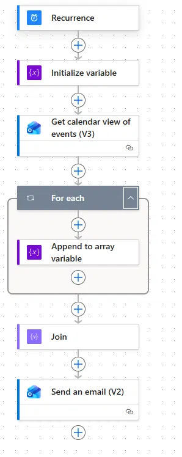

# Resumen diario de calendario (calendar digest)

Flujo programado que, cada mañana, recopila los eventos del día desde el calendario y envía un
único correo-resumen legible. El punto técnico interesante está en **hacer bien las zonas horarias**:
convertir donde el dato viene en UTC y **no** convertir donde ya viene en local.



> **Anonimizado**: sin identificadores de tenant, usuario, conexión, calendario ni correo.

## El problema

Quería recibir automáticamente, a primera hora, un resumen del día con todos los eventos del
calendario en un solo correo y en orden. La primera versión mostraba las **horas desplazadas**: un
clásico bug de zona horaria.

## El flujo (paso a paso)

1. **Recurrence** — se dispara cada día a las 08:00 (`Romance Standard Time`).
2. **Initialize variable** — array `Eventos` donde se irán acumulando las líneas.
3. **Get calendar view of events (V3)** — trae los eventos de hoy. La ventana del día se calcula en
   **hora local**:
   ```
   startDateTimeUtc: formatDateTime(convertTimeZone(utcNow(),'UTC','Romance Standard Time'),'yyyy-MM-ddT00:00:00')
   endDateTimeUtc:   formatDateTime(convertTimeZone(utcNow(),'UTC','Romance Standard Time'),'yyyy-MM-ddT23:59:59')
   ```
4. **For each → Append** — por cada evento añade una línea HTML:
   `<b>{asunto}</b> de {inicio HH:mm} a {fin HH:mm}`.
5. **Join** — une todas las líneas con `<br>` en un solo bloque.
6. **Send an email (V2)** — envía el resumen.

## Decisiones técnicas que importan

- **El bug de zona horaria, y su arreglo real.** "Los eventos de hoy" obliga a definir *qué es hoy* y
  *en qué zona*. Aquí hay dos fuentes con zonas distintas:
  - La **ventana del día** parte de `utcNow()`, que está en **UTC** → hay que convertir **una vez** a
    local para que "hoy" sea hoy en Madrid, no en UTC.
  - Las **horas de cada evento** ya llegan en **local** desde el conector → **no** se vuelven a
    convertir (se formatean directamente con `formatDateTime(..., 'HH:mm')`).

  El bug original era convertir *también* las horas de los eventos: doble conversión → horas
  desplazadas. El arreglo es convertir solo donde el origen es UTC (la ventana), no donde ya es local.
- **Construir el mensaje con array + `Join`** en vez de concatenar dentro del bucle: más limpio y sin
  separadores sobrantes al final.
- **Sin paso de ordenación manual:** la vista de calendario devuelve los eventos ya en orden
  cronológico, así que ordenar a mano sería redundante.

## Lo que aprendí

- Los bugs de "hora desplazada" casi nunca son de cálculo: son **conversiones de más o de menos**. La
  disciplina es saber, en cada paso, en qué zona está el dato.
- Acumular en un array y unir con `Join` al final produce texto más limpio que concatenar en el bucle.

## Archivos

- [`flow-export/flow-definition.sanitized.json`](./flow-export/flow-definition.sanitized.json) — la
  lógica real del flujo, anonimizada.
- [`docs/sample-output.md`](./docs/sample-output.md) — ejemplo del resumen generado (inventado).
- [`screenshots/`](./screenshots) — captura del flujo.
