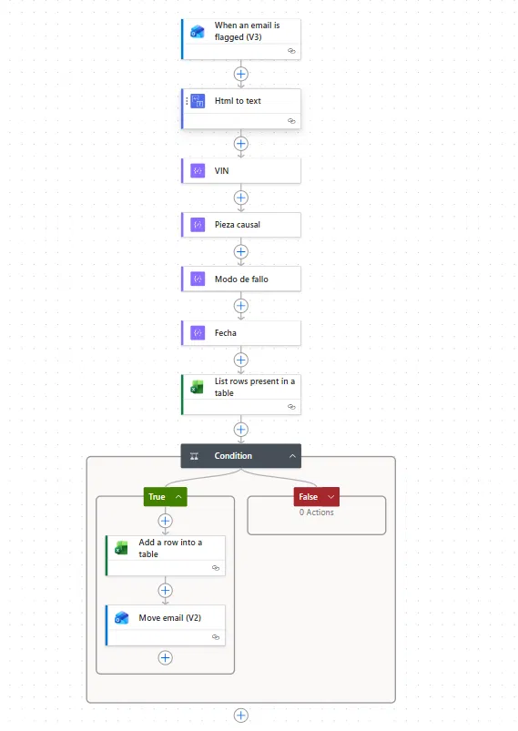

# Email → Excel: extractor de defectos con deduplicación

Automatización que, al **marcar (flag)** un correo de aviso, extrae campos estructurados de un
cuerpo en HTML irregular y los registra como **una única fila sin duplicados** en Excel,
normalizando la zona horaria y evitando condiciones de carrera. Tras registrar, archiva el correo.

> Dominio: seguimiento de defectos de calidad en automoción (patrón estándar tipo FMEA).



> **Anonimizado**: sin identificadores de tenant, usuario, conexiones, drive, tabla ni buzón.

## El problema

Un proceso de auditoría generaba avisos por correo. Cada aviso traía, dentro de un cuerpo HTML con
formato inconsistente, tres datos que alguien copiaba **a mano** a un Excel: el identificador del
vehículo, la pieza causal y el modo de fallo. Lento, propenso a errores, y con duplicados cuando
llegaba más de un aviso del mismo vehículo.

Objetivo: capturar cada aviso al marcarlo, extraer los campos y registrar **una sola fila por VIN**.

## El flujo (paso a paso)

1. **Disparador: "When an email is flagged (V3)".** El flujo arranca solo cuando marco un correo,
   no con cada correo entrante. Control de decisión humano + cero ejecuciones basura.
   `Concurrency = 1` (ver más abajo).
2. **Html to text.** El cuerpo llega en HTML; se convierte a texto plano antes de parsear.
3. **Extracción con `trim`/`split` (3 acciones Compose):** `VIN`, `Pieza causal`, `Modo de fallo`.
   Patrón por campo: cortar por la etiqueta, quedarse con lo que sigue, cortar en el salto de línea,
   limpiar espacios:
   ```
   trim(first(split(last(split(outputs('Html_to_text')?['body'], 'VIN:')), decodeUriComponent('%0A'))))
   ```
4. **Fecha con zona horaria:** `convertTimeZone(...receivedDateTime, 'UTC', 'Romance Standard Time', 'yyyy-MM-dd HH:mm')`.
5. **Chequeo de duplicado (List rows):** en lugar de traer toda la tabla y recorrerla, filtro en el
   propio Excel con `$filter: VIN eq '...'`. Deja el trabajo en el servidor, no en el flujo.
6. **Condición:** si el filtro devuelve **0 filas** → el VIN es nuevo →
   - **Add a row**: escribe VIN, Pieza causal, Modo de fallo, Fecha y un estado `ACABADO = No`.
   - **Move email**: archiva el correo en una carpeta de procesados.
   Si ya existía, no hace nada (rama `else` vacía).

## Decisiones técnicas que importan

- **Concurrencia = 1.** La dedup es *leer-luego-escribir*. Con ejecuciones en paralelo, dos avisos
  casi simultáneos del mismo VIN pueden leer ambos "no existe" y escribir dos filas. Serializar el
  disparador elimina esa carrera; se paga algo de rendimiento a cambio de integridad. Intercambio
  correcto cuando el dato manda sobre la velocidad.
- **Filtrar en Excel (`$filter`) en vez de traer y recorrer.** Menos datos, menos acciones, más
  rápido, y escala aunque la tabla crezca.
- **HTML → texto antes de parsear.** Hacer `split` sobre HTML es frágil; sobre texto plano, robusto.
- **Estado `ACABADO` + archivado del correo.** La fila nace con estado y el correo sale de la
  bandeja: el proceso es idempotente y auditable, no solo "mete filas".

## Lo que aprendí

- Las condiciones de carrera no son solo de "sistemas grandes": aparecen en un flujo de oficina en
  cuanto hay leer-luego-escribir y más de un evento.
- Delegar el filtrado a la fuente de datos suele batir a resolverlo en el orquestador.
- Parsear fiable empieza por **normalizar la entrada**, no por la expresión más lista.

## Archivos

- [`flow-export/flow-definition.sanitized.json`](./flow-export/flow-definition.sanitized.json) —
  la lógica real del flujo, anonimizada.
- [`docs/sample-input.md`](./docs/sample-input.md) — correo de ejemplo (inventado) y fila resultante.
- [`screenshots/`](./screenshots) — capturas del flujo con datos ocultos.
